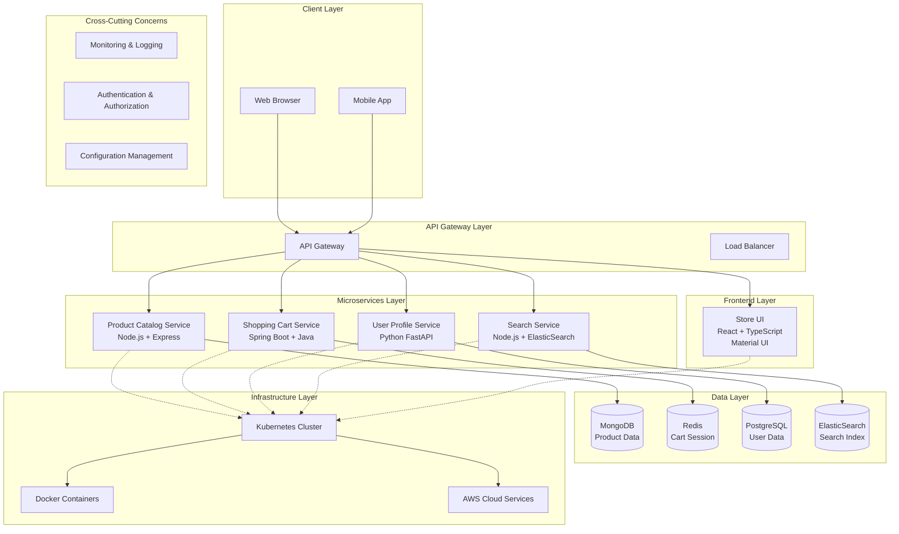

# 电商微服务架构蓝图

## 系统架构总结

这是一个基于云原生架构（Cloud Native Architecture）的现代电商平台，采用微服务架构模式，具有高度的可扩展性、弹性和技术多样性。

### 核心特征
- **多语言技术栈**：Java Spring Boot、Python FastAPI、Node.js Express、React
- **多数据库支持**：MongoDB、Redis、ElasticSearch、PostgreSQL
- **容器化部署**：Docker + Kubernetes
- **云原生设计**：支持本地和AWS云部署

## 系统架构图

## 详细服务架构

### 1. 前端服务层
| 组件 | 技术栈 | 职责 |
|------|--------|------|
| Store UI | React + TypeScript + Material UI | 用户界面、商品展示、购物车管理 |

### 2. 微服务层

| 微服务 | 技术栈 | 数据存储 | 主要功能 |
|--------|--------|----------|----------|
| **Product Catalog Service** | Node.js + Express | MongoDB | 商品信息管理、商品图片、商品分类 |
| **Shopping Cart Service** | Spring Boot + Java | Redis | 购物车管理、结账流程、会话管理 |
| **User Profile Service** | Python + FastAPI + SQLAlchemy | PostgreSQL | 用户账户管理、个人信息、认证授权 |
| **Search Service** | Node.js + ElasticSearch代理 | ElasticSearch | 搜索功能、自动完成、分面搜索 |

### 3. 数据层设计

| 数据库 | 类型 | 用途 | 特性 |
|--------|------|------|------|
| **MongoDB** | 文档数据库 | 商品目录 | 灵活的文档结构，适合商品多样化属性 |
| **Redis** | 内存数据库 | 购物车缓存 | 高性能会话存储，支持TTL |
| **PostgreSQL** | 关系数据库 | 用户数据 | ACID特性，强一致性要求 |
| **ElasticSearch** | 搜索引擎 | 全文搜索 | 高性能搜索，支持复杂查询 |

## 分阶段实施计划

### 第一阶段：核心基础设施搭建（4-6周）

#### 目标
建立基础开发和部署环境

#### 关键任务
1. **容器化环境搭建**
   - Docker环境配置
   - 本地Kubernetes集群（minikube）
   - 基础镜像标准化

2. **数据库基础设施**
   - MongoDB集群部署
   - Redis集群配置
   - PostgreSQL主从配置
   - ElasticSearch集群

3. **CI/CD流水线**
   - Git代码管理流程
   - Docker镜像构建自动化
   - Kubernetes部署脚本

#### 交付物
- [ ] 完整的本地开发环境
- [ ] 基础数据库集群
- [ ] CI/CD流水线框架

### 第二阶段：核心微服务开发（8-10周）

#### 目标
开发核心业务微服务

#### 关键任务
1. **Product Catalog Service开发**（2-3周）
   - RESTful API设计
   - MongoDB数据模型
   - 商品CRUD操作
   - 图片上传管理

2. **User Profile Service开发**（2-3周）
   - 用户注册/登录
   - JWT认证体系
   - 用户信息管理
   - 权限管理系统

3. **Shopping Cart Service开发**（2-3周）
   - 购物车状态管理
   - Redis会话存储
   - 结账流程设计
   - 订单预处理

4. **Search Service开发**（2周）
   - ElasticSearch集成
   - 搜索API设计
   - 自动完成功能
   - 分面搜索

#### 交付物
- [ ] 4个完整的微服务API
- [ ] 服务间通信机制
- [ ] 基础的错误处理和日志

### 第三阶段：前端集成开发（4-6周）

#### 目标
构建用户前端界面并集成后端服务

#### 关键任务
1. **React前端框架搭建**（1-2周）
   - 项目脚手架
   - Material UI组件库
   - TypeScript配置
   - 状态管理（Redux/Context）

2. **页面开发**（2-3周）
   - 商品展示页面
   - 用户注册/登录界面
   - 购物车界面
   - 搜索结果页面

3. **前后端集成**（1-2周）
   - API客户端封装
   - 错误处理机制
   - 认证状态管理
   - 响应式设计优化

#### 交付物
- [ ] 完整的React前端应用
- [ ] 前后端集成测试
- [ ] 用户体验优化

### 第四阶段：系统集成与优化（6-8周）

#### 目标
系统整体集成、性能优化和监控

#### 关键任务
1. **API网关集成**（2-3周）
   - 统一入口配置
   - 负载均衡策略
   - 限流和熔断机制
   - 路由规则配置

2. **监控和日志系统**（2-3周）
   - Prometheus + Grafana监控
   - ELK日志聚合
   - 应用性能监控（APM）
   - 健康检查机制

3. **安全性增强**（1-2周）
   - HTTPS配置
   - 安全头设置
   - 输入验证和防护
   - 秘钥管理

4. **性能优化**（1-2周）
   - 数据库查询优化
   - 缓存策略优化
   - 前端资源优化
   - 压力测试

#### 交付物
- [ ] 完整的监控仪表板
- [ ] 安全策略实施
- [ ] 性能基准测试报告

### 第五阶段：云部署与运维（4-6周）

#### 目标
云环境部署和生产运维体系

#### 关键任务
1. **AWS云环境搭建**（2-3周）
   - EKS Kubernetes集群
   - RDS数据库服务
   - ElastiCache Redis集群
   - Application Load Balancer

2. **Terraform基础设施即代码**（1-2周）
   - AWS资源自动化部署
   - 环境配置管理
   - 秘钥和配置分离
   - 蓝绿部署策略

3. **生产运维流程**（1-2周）
   - 备份恢复策略
   - 灾难恢复计划
   - 容量规划
   - 成本优化

#### 交付物
- [ ] 生产环境云部署
- [ ] 自动化运维脚本
- [ ] 运维手册和SOP

## 技术架构决策

### 微服务划分原则
1. **业务边界清晰**：每个服务有明确的业务职责
2. **数据独立性**：每个服务拥有独立的数据存储
3. **技术栈灵活性**：根据服务特性选择最适合的技术
4. **部署独立性**：服务可以独立部署和扩展

### 数据一致性策略
1. **最终一致性**：通过事件驱动实现跨服务数据同步
2. **补偿事务**：Saga模式处理分布式事务
3. **幂等性设计**：确保重试安全
4. **数据同步机制**：异步消息队列

### 服务通信模式
1. **同步通信**：HTTP/REST API用于实时查询
2. **异步通信**：消息队列处理业务事件
3. **服务发现**：Kubernetes内置服务发现
4. **负载均衡**：基于Kubernetes的自动负载均衡

## 质量保证策略

### 测试策略
1. **单元测试**：每个服务80%+代码覆盖率
2. **集成测试**：服务间接口测试
3. **端到端测试**：完整业务流程测试
4. **性能测试**：压力测试和基准测试

### 监控和运维
1. **应用监控**：指标、日志、链路追踪
2. **基础设施监控**：资源使用、网络、存储
3. **业务监控**：关键业务指标跟踪
4. **告警机制**：多层次告警策略

## 扩展性考虑

### 水平扩展策略
1. **服务实例扩展**：基于CPU/内存使用率自动扩展
2. **数据库扩展**：读写分离、分片策略
3. **缓存策略**：多级缓存架构
4. **CDN集成**：静态资源全球分发

### 未来演进路径
1. **服务网格**：Istio集成增强服务间通信
2. **事件驱动架构**：引入Kafka等消息中间件
3. **无服务器集成**：Lambda/Function即服务
4. **AI/ML集成**：推荐系统、智能搜索

## 参考资源

- [原始项目参考](https://github.com/venkataravuri/e-commerce-microservices-sample)
- [Spring Boot官方文档](https://spring.io/projects/spring-boot)
- [FastAPI文档](https://fastapi.tiangolo.com/)
- [React官方文档](https://reactjs.org/)
- [Kubernetes官方文档](https://kubernetes.io/)

## 贡献指南

欢迎提交Issue和Pull Request来完善这个架构蓝图。

## 许可证

MIT License

---

**注意**：这是一个架构设计文档，实际实施时需要根据具体业务需求进行调整和优化。