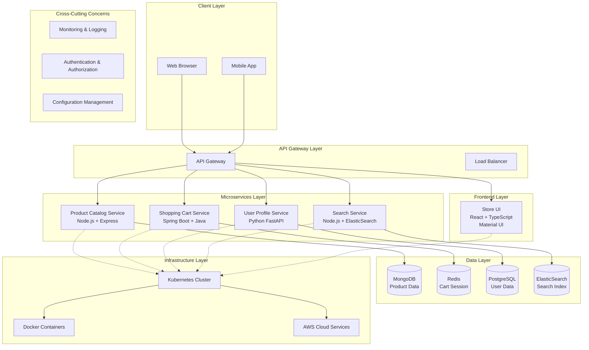

# E-commerce Microservices Architecture Blueprint

## System Architecture Overview

This is a modern e-commerce platform based on Cloud Native Architecture, adopting microservices architecture patterns with high scalability, resilience, and technological diversity.

### Core Features
- **Multi-language Technology Stack**: Java Spring Boot, Python FastAPI, Node.js Express, React
- **Multi-database Support**: MongoDB, Redis, ElasticSearch, PostgreSQL
- **Containerized Deployment**: Docker + Kubernetes
- **Cloud-native Design**: Supporting both local and AWS cloud deployment

## System Architecture Diagram

## Detailed Service Architecture

### 1. Frontend Service Layer
| Component | Technology Stack | Responsibility |
|-----------|------------------|----------------|
| Store UI | React + TypeScript + Material UI | User interface, product display, shopping cart management |

### 2. Microservices Layer

| Microservice | Technology Stack | Data Storage | Primary Functions |
|--------------|------------------|--------------|-------------------|
| **Product Catalog Service** | Node.js + Express | MongoDB | Product information management, product images, product categorization |
| **Shopping Cart Service** | Spring Boot + Java | Redis | Shopping cart management, checkout process, session management |
| **User Profile Service** | Python + FastAPI + SQLAlchemy | PostgreSQL | User account management, personal information, authentication & authorization |
| **Search Service** | Node.js + ElasticSearch Proxy | ElasticSearch | Search functionality, auto-completion, faceted search |

### 3. Data Layer Design

| Database | Type | Purpose | Characteristics |
|----------|------|---------|----------------|
| **MongoDB** | Document Database | Product Catalog | Flexible document structure, suitable for diverse product attributes |
| **Redis** | In-Memory Database | Shopping Cart Cache | High-performance session storage, TTL support |
| **PostgreSQL** | Relational Database | User Data | ACID properties, strong consistency requirements |
| **ElasticSearch** | Search Engine | Full-text Search | High-performance search, complex query support |

## Phased Implementation Plan

### Phase 1: Core Infrastructure Setup (4-6 weeks)

#### Objectives
Establish basic development and deployment environment

#### Key Tasks
1. **Containerization Environment Setup**
   - Docker environment configuration
   - Local Kubernetes cluster (minikube)
   - Base image standardization

2. **Database Infrastructure**
   - MongoDB cluster deployment
   - Redis cluster configuration
   - PostgreSQL master-slave setup
   - ElasticSearch cluster

3. **CI/CD Pipeline**
   - Git code management workflow
   - Docker image build automation
   - Kubernetes deployment scripts

#### Deliverables
- [ ] Complete local development environment
- [ ] Basic database clusters
- [ ] CI/CD pipeline framework

### Phase 2: Core Microservices Development (8-10 weeks)

#### Objectives
Develop core business microservices

#### Key Tasks
1. **Product Catalog Service Development** (2-3 weeks)
   - RESTful API design
   - MongoDB data model
   - Product CRUD operations
   - Image upload management

2. **User Profile Service Development** (2-3 weeks)
   - User registration/login
   - JWT authentication system
   - User information management
   - Permission management system

3. **Shopping Cart Service Development** (2-3 weeks)
   - Shopping cart state management
   - Redis session storage
   - Checkout process design
   - Order preprocessing

4. **Search Service Development** (2 weeks)
   - ElasticSearch integration
   - Search API design
   - Auto-completion functionality
   - Faceted search

#### Deliverables
- [ ] 4 complete microservice APIs
- [ ] Inter-service communication mechanisms
- [ ] Basic error handling and logging

### Phase 3: Frontend Integration Development (4-6 weeks)

#### Objectives
Build user frontend interface and integrate backend services

#### Key Tasks
1. **React Frontend Framework Setup** (1-2 weeks)
   - Project scaffolding
   - Material UI component library
   - TypeScript configuration
   - State management (Redux/Context)

2. **Page Development** (2-3 weeks)
   - Product display pages
   - User registration/login interface
   - Shopping cart interface
   - Search results page

3. **Frontend-Backend Integration** (1-2 weeks)
   - API client encapsulation
   - Error handling mechanisms
   - Authentication state management
   - Responsive design optimization

#### Deliverables
- [ ] Complete React frontend application
- [ ] Frontend-backend integration testing
- [ ] User experience optimization

### Phase 4: System Integration & Optimization (6-8 weeks)

#### Objectives
Overall system integration, performance optimization, and monitoring

#### Key Tasks
1. **API Gateway Integration** (2-3 weeks)
   - Unified entry configuration
   - Load balancing strategies
   - Rate limiting and circuit breaker mechanisms
   - Routing rule configuration

2. **Monitoring and Logging Systems** (2-3 weeks)
   - Prometheus + Grafana monitoring
   - ELK log aggregation
   - Application Performance Monitoring (APM)
   - Health check mechanisms

3. **Security Enhancement** (1-2 weeks)
   - HTTPS configuration
   - Security header settings
   - Input validation and protection
   - Secret management

4. **Performance Optimization** (1-2 weeks)
   - Database query optimization
   - Caching strategy optimization
   - Frontend resource optimization
   - Load testing

#### Deliverables
- [ ] Complete monitoring dashboard
- [ ] Security policy implementation
- [ ] Performance benchmark test reports

### Phase 5: Cloud Deployment & Operations (4-6 weeks)

#### Objectives
Cloud environment deployment and production operations system

#### Key Tasks
1. **AWS Cloud Environment Setup** (2-3 weeks)
   - EKS Kubernetes cluster
   - RDS database services
   - ElastiCache Redis cluster
   - Application Load Balancer

2. **Terraform Infrastructure as Code** (1-2 weeks)
   - AWS resource automation deployment
   - Environment configuration management
   - Secret and configuration separation
   - Blue-green deployment strategy

3. **Production Operations Process** (1-2 weeks)
   - Backup and recovery strategy
   - Disaster recovery plan
   - Capacity planning
   - Cost optimization

#### Deliverables
- [ ] Production environment cloud deployment
- [ ] Automated operations scripts
- [ ] Operations manual and SOPs

## Technical Architecture Decisions

### Microservices Division Principles
1. **Clear Business Boundaries**: Each service has clear business responsibilities
2. **Data Independence**: Each service owns independent data storage
3. **Technology Stack Flexibility**: Choose the most suitable technology based on service characteristics
4. **Deployment Independence**: Services can be deployed and scaled independently

### Data Consistency Strategy
1. **Eventual Consistency**: Achieve cross-service data synchronization through event-driven approach
2. **Compensating Transactions**: Saga pattern for handling distributed transactions
3. **Idempotent Design**: Ensure retry safety
4. **Data Synchronization Mechanism**: Asynchronous message queues

### Service Communication Patterns
1. **Synchronous Communication**: HTTP/REST API for real-time queries
2. **Asynchronous Communication**: Message queues for business events
3. **Service Discovery**: Kubernetes built-in service discovery
4. **Load Balancing**: Kubernetes-based automatic load balancing

## Quality Assurance Strategy

### Testing Strategy
1. **Unit Testing**: 80%+ code coverage for each service
2. **Integration Testing**: Inter-service interface testing
3. **End-to-End Testing**: Complete business process testing
4. **Performance Testing**: Load testing and benchmarking

### Monitoring and Operations
1. **Application Monitoring**: Metrics, logs, distributed tracing
2. **Infrastructure Monitoring**: Resource usage, network, storage
3. **Business Monitoring**: Key business metrics tracking
4. **Alerting Mechanism**: Multi-level alerting strategy

## Scalability Considerations

### Horizontal Scaling Strategy
1. **Service Instance Scaling**: Auto-scaling based on CPU/memory utilization
2. **Database Scaling**: Read-write separation, sharding strategies
3. **Caching Strategy**: Multi-tier caching architecture
4. **CDN Integration**: Global distribution of static resources

### Future Evolution Path
1. **Service Mesh**: Istio integration for enhanced inter-service communication
2. **Event-Driven Architecture**: Introduction of Kafka and other message middleware
3. **Serverless Integration**: Lambda/Function as a Service
4. **AI/ML Integration**: Recommendation systems, intelligent search

## Reference Resources

- [Original Project Reference](https://github.com/venkataravuri/e-commerce-microservices-sample)
- [Spring Boot Official Documentation](https://spring.io/projects/spring-boot)
- [FastAPI Documentation](https://fastapi.tiangolo.com/)
- [React Official Documentation](https://reactjs.org/)
- [Kubernetes Official Documentation](https://kubernetes.io/)

## Contributing Guidelines

Welcome to submit Issues and Pull Requests to improve this architecture blueprint.

## License

MIT License

---

**Note**: This is an architectural design document. Actual implementation should be adjusted and optimized according to specific business requirements.